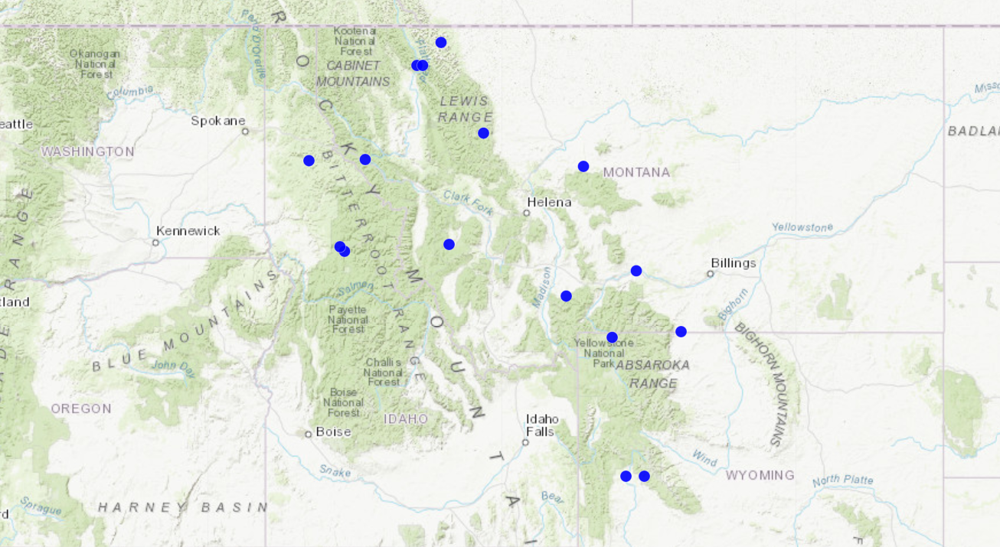
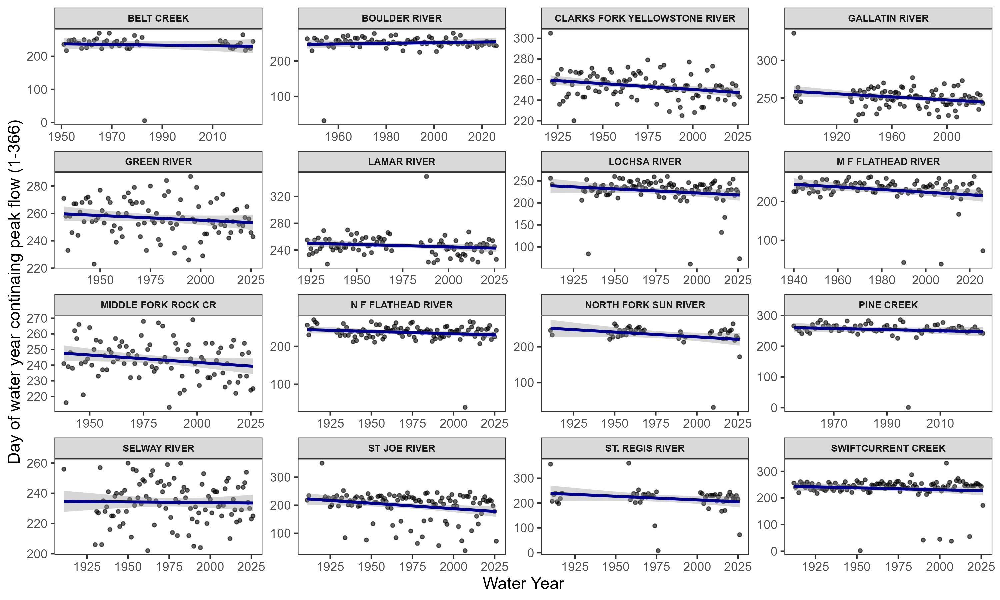
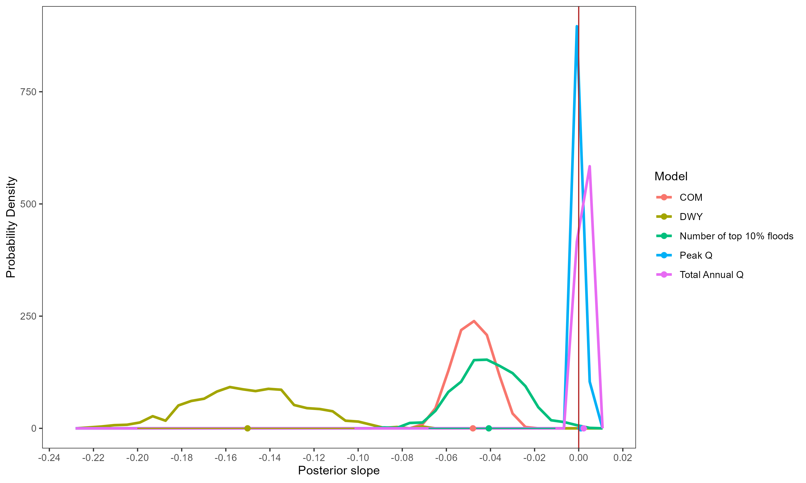
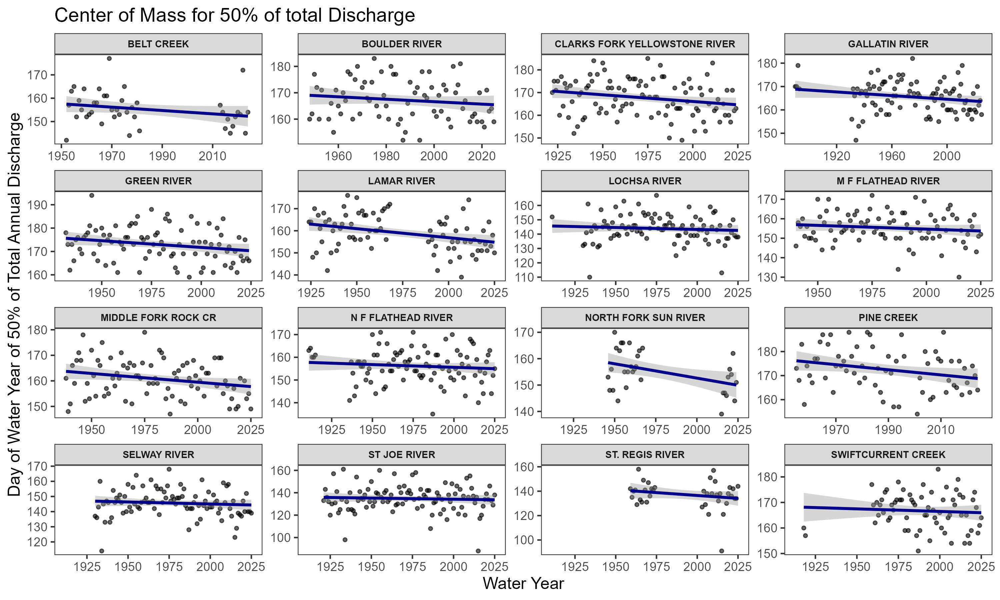
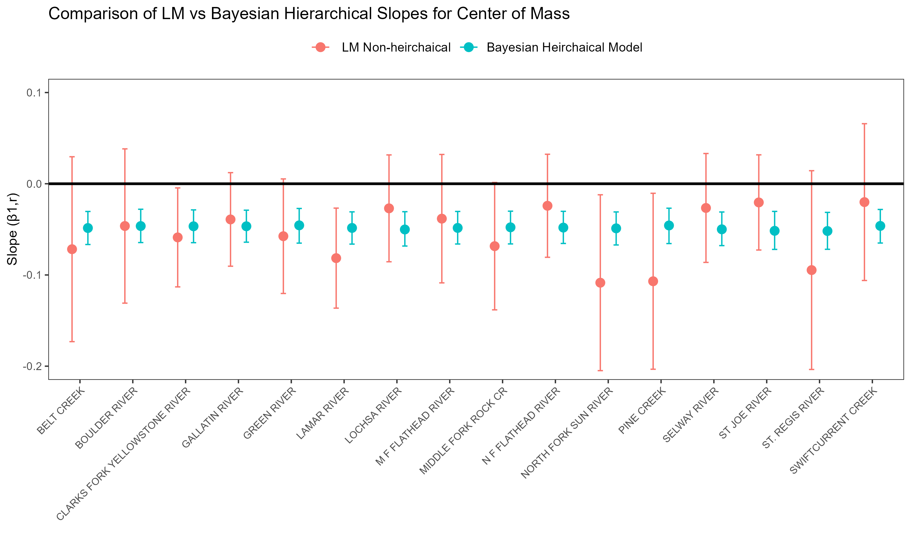
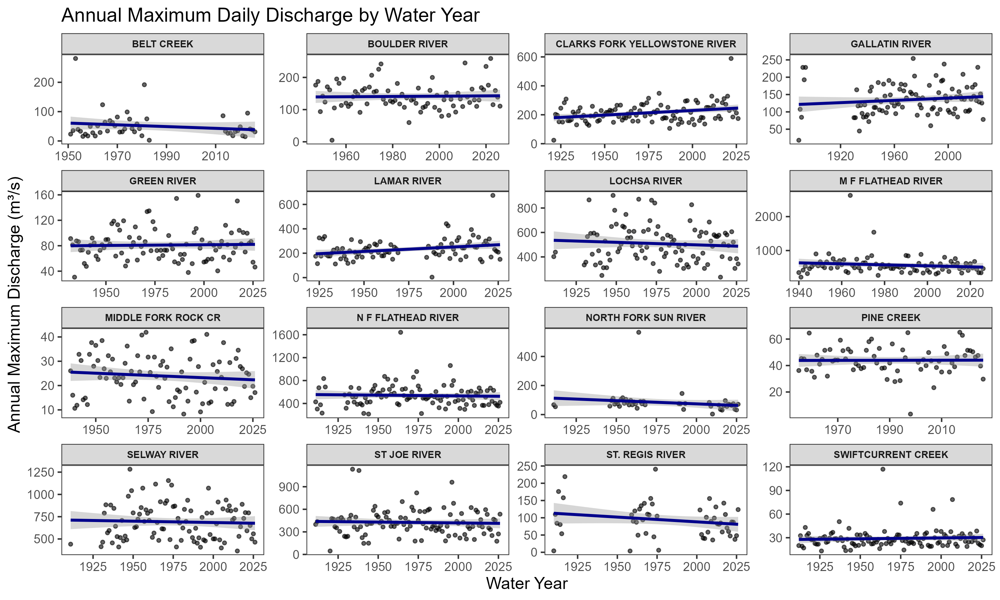
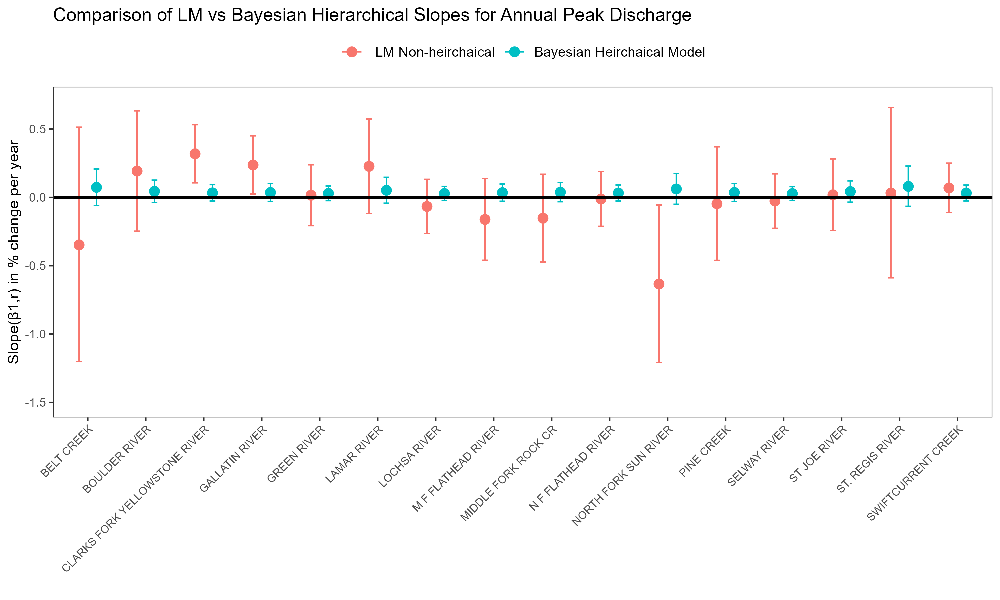

# Bayesian hierarchical regression analysis of timing and magnitude for free-flowing river extremes in the Intermountain West

**Kyra R. Baranick ^1,2^, Robert O. Hall, Jr.^1^, and Nanette M. Nelson^1^**

^1^ University of Montana: Flathead Lake Biological Station Polson, MT, USA

^2^ University of California Santa Barbara, Santa Barbara, CA, USA

## Abstract

## Introduction

In high elevation temperate regions, greater then 60% of peak flows are driven by warmer storms arriving over vulnerable snowpack, known as rain-on-snow (RoS) floods [@SURFLEET201324]. In temperate mountain ranges, snowpack is often close to its melting point and sensitive to minor changes in temperature, precipitation type, or timing. Rain-on-snow (RoS) events are responsible for some of the most devastatingly large floods in the Intermountain West, most notably the 1964, 500-year flood that claimed 31 lives and caused \$539,000,000 million in damages (reported in 2026 CPI inflation adjusted value) [@usgs1967wsp1840c]. In the last 100 years, the Intermoutnain West has warmed by 0.5C-1.5C and this number is expected to increase to 2C and 5C by the end of the century[@Chambers2008]. Under a warmer future, RoS frequency and spring precipitation are projected to increase, while snowpack is expected to decrease in quantity and melt earlier [@SURFLEET201324; @pederson2011climatic]

Projections of snowpack and temperature changes describe shifts, but decision making relies on evidence using in-situ USGS stream gage data, where these factors and others combine into the realized streamflow. Probabilistic and regional understandings of change can provide robust estimates and quantification of uncertainty surrounding river timing and magnitude. Changes in timing and magnitude of hydrologic pulses, may have impacts to human safety, agricultural production, and ecosystems. As the Intermountain West is a region of economic and population growth, water and emergency managers must be aware of changes to the hydrology of the area to minimize economic, societal, and environmental costs through informed decision making.

This study employs a Bayesian hierarchical model to answer the following (1) To what extent are peak discharge, timing, and magnitude shifting in response to evolving hydrologic regimes using probabilistic estimates?; (2) How do these probabilistic estimates of change compare to a non-hierarchical, river-by-river regression model? To answer these questions we undertook the following research objectives.

Hydrologic change objectives:

1.  Quantified shifts in the peak discharge timing across rivers by modeling changes in the day of the water year (DWY) that the annual peak flow occurs.

2.  Estimated changes to the timing of the water year center of mass (COM) to determine the degree to which 50% runoff timing may be changing through time.

3.  Estimated the change in the magnitude of annual peak discharge, to assess whether extreme flows are intensifying, diminishing or stabilizing through time.

Model evaluation objective:

4.  Assessed the extent to which the Bayesian Hierarchical model produces more precise and interpretable trend estimates than the river-by-river regression. #This includes comparing slope and uncertainties across individual watersheds to determine whether the Bayesian model detects a coherent signal the non-hierarchical fit fails to detect.

This study makes several contributions to the understanding of flood hydrology. A common way to analyze trends is to analyze each river independently, what we refer to here as the non-hierarchical, river-by-river analysis. However, streamflow data is highly sensitive to noise, meaning that treating each river as its own independent data set may reflect random fluctuation rather than true change over time. The Bayesian hierarchical model partially pools this information and assumes rivers share the same distribution, as they come from similar climatic regions. This dramatically decreases the influence of noise from the observation level and allows us to evaluate the underlying pattern of hydrologic change over time.

A comprehensive review of Bayesian methods in hydrology highlights this model as the cornerstone of modern hydrological modeling due to the capacity to handle uncertainties in data [@haddad2025comprehensive]. Evaluating a river-by river regression with the Bayesian hierarchical regression reveals whether the individual trends are adequate indicators of regional change or whether hierarchical pooling is necessary to extract the climate driven signal.

### Study area

This study focuses on the Intermountain West, specifically Montana, Idaho and northern Wyoming. The major mountain ranges involved include the Abasroka-Beartooth Mountains, Gallatin Range, Bitterroot Range, Clearwater Mountains, and the Lewis and Livingston Ranges with gauge elevation at about 400-2000m above sea level. The sampled area was limited to mountains west of the Cascades, as the climate in the Northern U.S. Rocky Mountain region is more continental, with a larger annual average temperature range of about 5C larger then the coastal western ranges. [@price1978mountains]. It is estimated that over 50% and as high as 80% of the annual stream discharge originates as snow[@zheng2018predictive; @pederson2011climatic].

Many U.S rivers are a part of a dammed – or in other ways altered system – to manage water supply and protect cities and ecosystems from extreme high and low flows. However, the mountainous western portion of free-flowing river reaches can provide insights into the effects of climate change, with minimal direct human influence on streamflow timing and quantity.

{fig-align="center" width="521"}

## Methods

### Data

Daily and Instantaneous stream gage data was retrieved from United States Geologic Survey (USGS) and sites were hand selected using USGS Stream Stats, an information and interactive map service [@usgs_streamstats]. Rivers and streams were selected in free-flowing watersheds that drain mountainous regions of the northwestern United States. Watersheds that contained dams, diversions, flow-altering infrastructure or agricultural land greater then 1% of drainage area, were not eligible for this study. On each identified river, the most upstream stream gage that began operation before 1950 and is still in operation as of 2026 was selected. All selected sites began operation between 1888 and 1954. Years that contained fewer than 300 days were excluded form the analysis.

A complete list of gages with corresponding drainage area, regulation status, land cover, and period‑of‑record metadata is provided in Appendix A.

```{r}
library(dplyr)
library(gt)

site_info1 <- readRDS("images/site_info1.rds")

site_info1 <- site_info1 |>
  rename(`Drainage Area (km²)` = `Drainage Area (km^2^)`)

#| tbl-cap: "USGS gaging stations used in the analysis."

site_info1 |>
  gt() |>
  fmt_number(
    columns = c(`Drainage Area (km²)`, `Gage Elevation (m)`),
    decimals = 1
  ) |>
  cols_align(
    align = "center",
    columns = everything()
  ) |>
  tab_options(
    table.width = pct(100),
    column_labels.font.weight = "bold",
    data_row.padding = px(4),
    table.font.size = 10
  ) |>
  cols_width(
    `Gage ID` ~ px(120),
    `Site Name` ~ px(260),
    `Drainage Area (km²)` ~ px(140),
    `Gage Elevation (m)` ~ px(140)
  )

```

A complete list of gages with corrosponding drainage area, regulation status, land cover, and period‑of‑record metadata is provided in Appendix A.

## Estimating hydrologic change

### Data manipulation before modeling

1.  Day of water year containing annual peak discharge–(DWY) (objective 1): After daily value gage data was obtained from the USGS NWIS database, annual maxima were extracted for each water year. The water year is 365 or 366 days, beginning October 1^st^ and ending September 31^st^ of the following year. Each annual maxima is assigned a corresponding digit, 1-366, representing the day of the water year that the annual peak flow occurs.
2.  Center of mass of annual flows–(COM) (objective 2): The center of mass was calculated using the 'faastr' package in R. Mathematically, it is calculated by summing the daily discharge values (per year and per river) and identifying the day in which the cumulative total reaches 50% of that years flow.
3.  Annual maximum discharge (m^3^s) (objective 3): Daily value gauge data was obtained from the USGS NWIS database, annual maxima were extracted for each water year and converted to cubic meters per second (m^3^/s). Standardized z-scores were calculated across individual river means.

### Model

#### Model for center of mass and annual maximum peak-flow timing

To evaluate long-term effects of climate change on the timing of annual maximum stream flow and the center of mass of flows, we fit a multilevel linear regression model with partial pooling using the "brms" package in R. The response variable is the day of the year that the peak flow or center of mass occurred and the 'water year' was held as the predictor to estimate change over time. This model was selected because the annual maximum stream flow timing and the day of the center of mass is expected to vary while sharing the same climatic drivers. Partial pooling allows this trend to be estimated using information and strength coming from the individual observations of the river, in conjunction with the collective behavior of the rivers in this region, as a response to changes over time.

Weakly informative normal (0,0.5) priors were specified for each hierarchical regression and because our observations came from 16 different free-flowing rivers we allowed both the intercept and slopes to vary using:

$$(D_{y,r})= \beta_{0,r} +\beta_{1,r} * t  + \varepsilon_{y,r}$$

where $\beta_{0,r}$ is the river specific intercept, $\beta_{1,r}$ represents the river specific slope, $t$ is the time in years and $\varepsilon_{y,r}$ is the normally distributed error in the observations.

The rivers are assumed to come form a multivariate normal distribution of:

$$
\begin{pmatrix}
\beta_{0,r} \\
\beta_{1,r}
\end{pmatrix}
\sim
\mathrm{MVN}
\left(
\begin{pmatrix}
\mu_{\beta_0} \\
\mu_{\beta}
\end{pmatrix},
\mathbf{\Sigma}
\right)
$$

With this model partial pooling is implied in that each individual river borrows strength form the full data set.

#### Model for annual maximum discharge

The change in annual maximum discharge was also evaluated using the Bayesian hierarchical model however, because rivers differ substantially in drainage area, many of the discharge values very in magnitude. To place all rivers on a comparable scale, the regression model for the change in annual maximum discharge over time was log-transformed and then standardized using a z-score transformation. This procedure centers each years annual maximum discharge around the mean of the river it belongs to, scaled by its standard deviation, preventing trends form being dominated by river size.

$$
A_{\text{std}, r, t}
=
\frac{
\log(A_{r,t}) - \mu_{\log A, r}
}{
\sigma_{\log A, r}
}
$$

To interpret the results all slope values were back transformed to percent change per year. Because the regression model was fit using z-score, the original output describes changes in standardized log units per year. This standardized values $A_{\text{std}, r}$ were first multiplied by each rivers standard deviation $\sigma_{\log A, r}$ of log discharge and then exponentiated to represent a multiplicative factor for annual change in discharge $\exp\!\left(
\Delta A_{\text{std}, r} \cdot \sigma_{\log A, r}
\right)- 1)$. This change was multiplied by 100 to obtain the annual % change for each river, $\beta_{1,r}$. .$$
\%\Delta A_{r}
=
\left(
\exp\!\left(
\Delta A_{\text{std}, r} \cdot \sigma_{\log A, r}
\right)
-
1
\right)
\times 100
$$

## Results

![Posterior slope probability density histogram for center of mass (COM), day of water year containing annual peak flow (DWY), and discharge, based on 1000 posterior draws. Horizontal segments across the x-axis represent the 90% confidence interval for each model and the dot represents the posterior mean slope. The red vertical line is the zero threshold, meaning no positive or negative slope. This visualization highlights the difference in slope and confidence among the modeled variables with discharge exhibiting a tightly constrained slope near zero and the DWY and COM showing a stronger negative slope.](png/post_all.png){fig-align="center"}

### Timing: DWY (containing peak discharge), Center of Mass (50% of total discharge)

Across the 16 rivers, posterior estimates form the Bayesian Hierarchical model indicates a regional shift towards earlier center of mass (COM) and peak discharge day of water year (DWY) timing. The model estimates that the day of the water year that contains the peak annual discharge is shifting between 0.10 and 0.21 days earlier per year, meaning peak annual discharge will occur roughly a week earlier every 50 years. The model estimates that the COM is shifting by 0.03 to .07 days per year, equivalent to 3 to 7 days every 100 years. Figure 1 shows the full posterior distribution for the regional COM and DWY trend. The distribution for both timing metrics is centered entirely below zero with a narrow confidence interval demonstrating high certainty in the estimate.

### Magnitude: Annual Peak Discharge (m^3^/s)

The 95% confidence interval for the slope of the magnitude of the annual maximum discharge over time remains tightly around zero, indicating the the model detected no regional change to discharge over time (Figure 1).

### Justification for Pooling

Using the day of peak annual discharge variable as an example, we contrast the river by river non-hierarchical regression model with the Bayesian regression model.

When examining data from the DWY that peak discharge occurs, it is clear that the observation level data is highly variable (Figure 2). When fitting a linear regression line to these points, it is unclear whether the slope is a product of data noise or true change over time. The linear model can also lead to overfitting especially when the record of data contain large gaps. In several rivers such as the St. Regis River, and the North Fork Sun River the data contains two period of large data gaps and several outliers that steepen the river specific slope estimate. In other rivers, such as the Green River and the Selway river, the data appear in a cloud shape around the regression line, making the slope estimate quite uncertain and difficult to interpret.

{fig-align="center"}

Treating these rivers as a interconnected system draws meaning from this noise and makes the slope estimate interperetable. The river-by-river non-hierarchical model contains variable slope estimations and large confidence intervals, over half of which cross zero, indicating the directional trend is indistinguishable. In contrast, the Bayesian hierarchical model produces a narrower distribution of slopes and smaller uncertainty across rivers. This pattern reflects shrinkage, where rivers with gaps or noisy observations are pulled towards the regional mean.


## Discussion

Our Bayesian hierarchical analysis reveals a consistent decreasing timing (DWY and COM) across snowmelt dominated, free-flowing rivers in the Intermountain West but shows no change in magnitude of floods (annual max discharge). We also prove that these statements are estimated with greater certainty using this model over the nosier river-by-river linear regression.

Numerous observational studies have proven earlier peak timing in snowmelt dominated basins across the globe [@dudley2017trends; @HODGKINS2003244; @XingSnowDominated]. Our study shows that the Intermountain West is not exception to this trend. It is noted that this trend will continue due to warmer temperatures under a business-as-usual climate scenario [@stewart2004changes].

It has been widely accepted that a warmer climate will accelerate the hydrologic cycle, increase atmospheric water holding capacity, precipitation extremes, and the occurrence of rain-on-snow events [@KUNDZEWICZ2008195; @fischer2016observed; @SURFLEET201324]. However, there has been disagreements about whether these factors directly translate into increased peak flows over time[@zhang2022reconciling]. Consistent with the results of this paper, many snowmelt dominated regions show low-to-no trend of increasing magnitude or peak flows consistent with time or increase in CO₂[@Hirsch01012012; @Kundzewicz02012014]. We hypothesize that this is due to a spacial variability and multitude of warming driver factors that may suppress or accelerate runoff peaks. Theories include, changes in basin specific soil moisture, changes in flood drivers, [@zhang2022reconciling; @TANG2019255] or competition between decreasing snow pack and accelerated runoff [@wang2016potential]. Because our study is in the rain-snow transition zone, and runoff drivers are shifting, its is reasonable that our Bayesian Hierarchical model did not estimate a positive or negative trend in peak flow magnitude. However, because we did not group by runoff drivers (rain-on-snow, snow pack, or precipitation type) it is possible that more specific change in peak flow magnitude is occurring despite lack of complete regional change.

The type of analysis performed also drives interpretation of climate driven change. In our comparison of the non-hierarchical linear regression and the Bayesian regression model, we show the influence of partial pooling on the success of extracting the regional signal.

(not sure about this next part...)

We also noticed that many hydrologists use the Manning-Kendall (MK) test [@dudley2017trends;]. This evaluates each river independently and assigns a +1, -1, or 0 for each pair of years representing a positive, negative or no change from the last year to the next year. MK treat rivers independently

It is important to recognize that the Bayesian hierarchical model contains limitations as well but due to \_\_\_\_ is is often able to detect a credible signal while other tests may fail. The greatest advantage of the Bayesian Hierarchical Model is the computation of a full posterior distribution and credible intervals for the certainty of the regional estimate. This model can also be adapted to more complex applications and the model can be updated as new climate and hydrologic data is published [@haddad2025comprehensive].





{#fig-slope-comparison}

### Timing: Day of Year of Peak Annual Flow

### Volume: Annual Peak Discharge in Percent Change per Year






# Supplementary Materials

[Download Site Justification PDF](SiteJustification.pdf)
